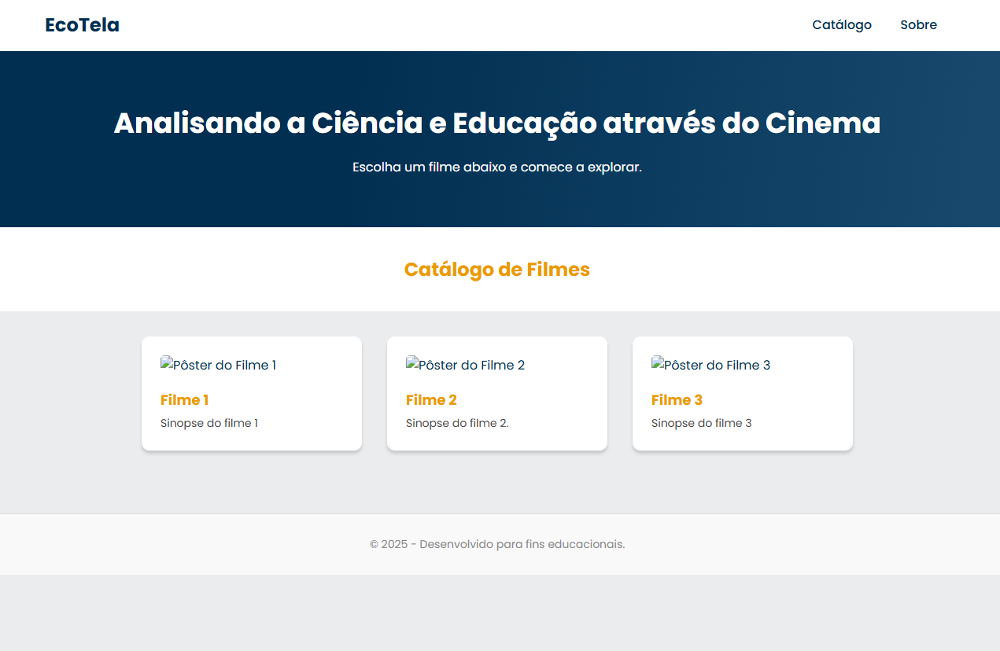

# EcoTela: Ferramenta de Análise de Filmes

Bem-vindo ao projeto EcoTela! Este é um site educacional simples, criado com HTML e CSS, projetado para explorar conceitos científicos através da análise de filmes de ficção científica. O site serve como um catálogo interativo onde os alunos podem escolher um filme e acessar uma página dedicada com o trailer e questões para reflexão.

## 🚀 Funcionalidades
- **Catálogo de Filmes**: Uma página inicial (`index.html`) que apresenta os filmes disponíveis para análise em um formato de cards.
- **Páginas de Análise Dedicadas**: Cada filme possui sua própria página com:
  - O trailer oficial incorporado do YouTube.
  - Uma lista de perguntas para guiar a discussão e a reflexão.
- **Design Responsivo**: O layout foi construído para se adaptar a diferentes tamanhos de tela, funcionando bem em desktops e dispositivos móveis.
- **Navegação Simples**: Uma interface limpa e intuitiva que permite aos usuários navegar facilmente entre o catálogo e as páginas de análise.

## 🛠️ Tecnologias Utilizadas
Este projeto foi construído utilizando tecnologias web fundamentais:
- **HTML5**: Para a estruturação e semântica do conteúdo.
- **CSS3**: Para a estilização, layout (Flexbox) e responsividade.
- **Google Fonts**: Para a importação da fonte "Poppins", garantindo um visual moderno.

# Licença
Este projeto é distribuído sob a licença MIT. Veja o arquivo LICENSE para mais detalhes. Sinta-se à vontade para usar, modificar e distribuir este código para fins educacionais ou pessoais.

